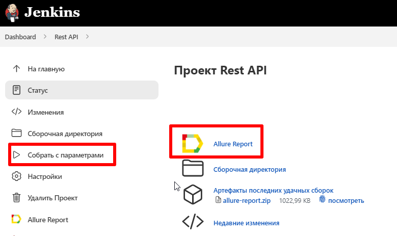
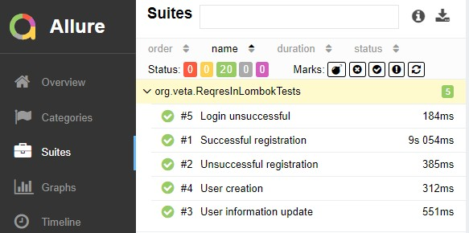

# Automated API tests for [reqres.in](https://reqres.in/)

##	Content

- [Tools and technologies](#technologist-технологии-и-инструменты)
- [Implemented tests](#bookmark_tabs-реализованные-проверки)
- [Tests launch with terminal](#computer-запуск-тестов-из-терминала)
- [Tests launch with Jenkins](#-запуск-тестов-в-jenkins)
- [Tests result report with Allure Report](#-отчет-о-результатах-тестирования-в-Allure-report)

## Tools and technologies
<p  align="center">

<code></code>
<code></code>
<code></code>
<code></code>
<code></code>
<code></code>
<code></code>
<code></code>
<code></code>

</p>

## Implemented tests with Pojo and Lombok models, Specifications:

- New user creation
- Successfull registration
- Unsuccessfull registration
- User information update
- Login unsuccessfull

## Test launch with ternminal

### Local test launch

```bash
gradle clean test
```

##  Запуск тестов в [Jenkins](https://jenkins.autotests.cloud/job/Rest%20API/)

For test run need to click on button <code><strong>*Собрать*</strong></code>.

<p align="left">
  
</p>

After test run block <code><strong>*История сборок*</strong></code> opposite run number logo
*Allure Report* should appear, after click on it, page with html-report will be opened.

##  Report with tests result with [Allure Report](https://jenkins.autotests.cloud/job/tmaksyutov_diplom_api/allure/)

<p align="left">
  
</p>

<p align="left">
  
</p>


